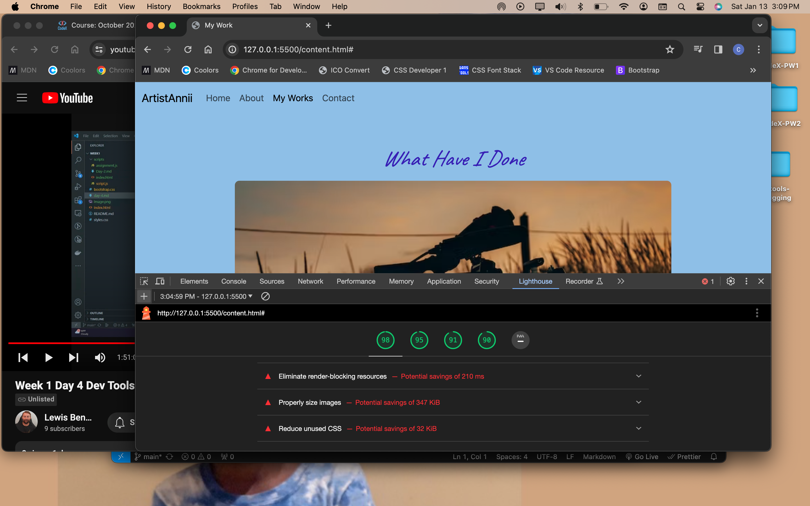
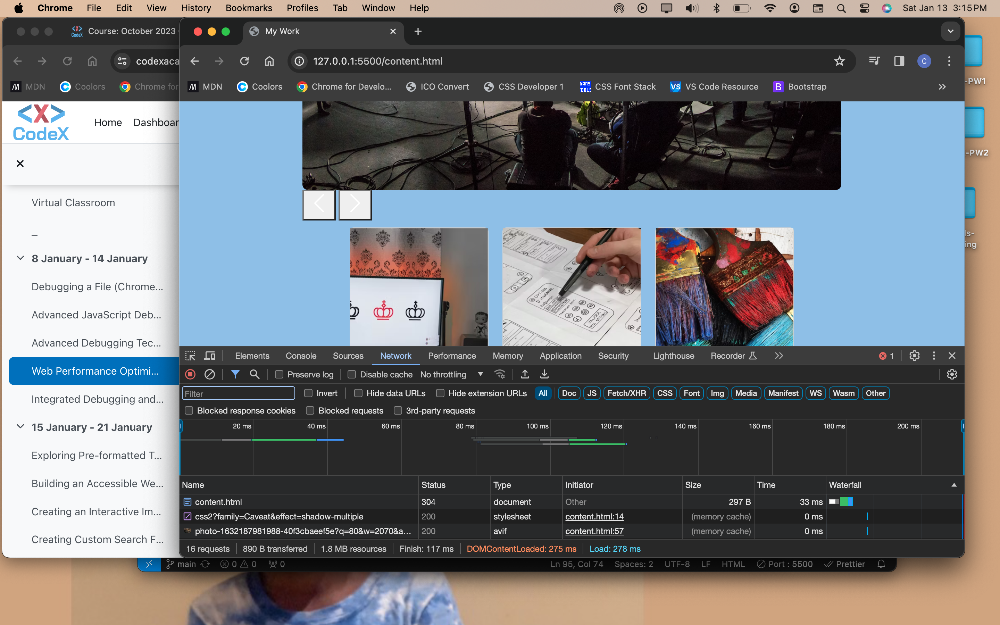

## Lighthouse Info

All scores were 90 or higher, but I would like to remove some unnecessary elements to optimize the page a bit more.

## Network

The results from the network test seems to show the page is loading pretty swiftly without errors or lagging.

## Overall

It was great to use these tools and see how they can be handy in future and larger scaled projects. Improving the optimization and network speeds are things I appreciate when I load a site, and I want to be able to bring that to any codes I may develop in the future
